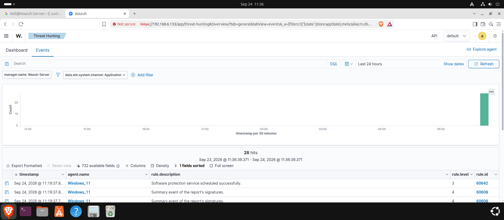
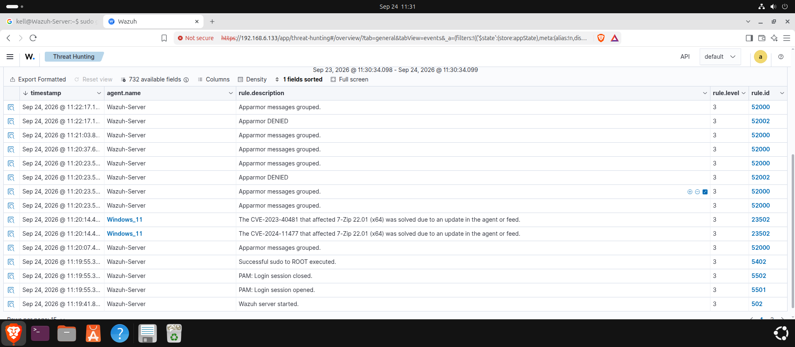
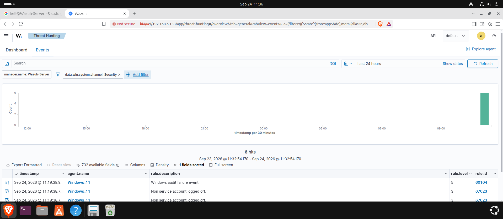
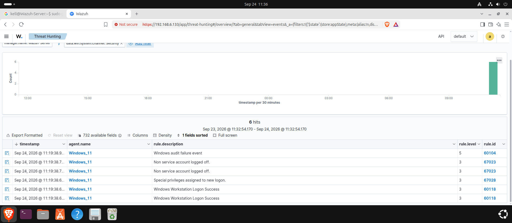

# Lab Report: Wazuh Alert Triage Exercise

**Course / Module:** SIEM & Threat Hunting Operations

**Target Environment:** Wazuh SIEM (`192.168.6.133`)

**Monitored Agents:** `Windows_11` (Agent 002) & `Wazuh-Server` (Manager)

**Tools Used:** Wazuh Dashboard (Threat Hunting → Events)

---

## 1. Objective

The objective of this exercise is to select three distinct alerts/events from the Wazuh Dashboard, record their core metadata (rule/alert level, description, source agent, and timestamp), and define a recommended first triage action for each — demonstrating a practical SOC analyst workflow for initial alert review.

---

## 2. Methodology

Events were reviewed in the Wazuh Dashboard's **Threat Hunting → Events** view, using the last 24 hours as the time window. Results were narrowed using the `data.win.system.channel` filter to isolate Security and Application channel events on `Windows_11`, and the unfiltered event stream was reviewed to capture activity from the `Wazuh-Server` agent itself.

*Figure 1: Application channel events on Windows_11.*

*Figure 2: Baseline event stream across Wazuh-Server and Windows_11.*

*Figure 3: Security channel events on Windows_11 (initial view).*

*Figure 4: Full Security channel event list on Windows_11.*

---

## 3. Selected Alerts & Triage Summary

Three alerts were selected to represent a spread of severity levels, rule categories, and source agents:

| # | Rule ID | Alert Level | Description | Agent | Timestamp | Recommended First Triage Action |
|---|---|---|---|---|---|---|
| 1 | 60104 | 5 | Windows audit failure event | Windows_11 | Sep 24, 2026 @ 11:19:38.9... | Pivot into the full event details to identify which audit subsystem/component failed and why (e.g., misconfigured policy, service crash). Cross-check for a pattern of repeated failures, which could indicate an attempt to disable or evade logging rather than a benign glitch. |
| 2 | 52002 | 3 | Apparmor DENIED | Wazuh-Server | Sep 24, 2026 @ 11:22:17.1... | Identify the specific process/profile that was denied and the resource it tried to access. A single denial from a known service is usually routine hardening noise; a denial from an unexpected binary or a spike in denials from the same process warrants checking what triggered the access attempt. |
| 3 | 67028 | 3 | Special privileges assigned to new logon | Windows_11 | Sep 24, 2026 @ 11:19:38.6... | Verify the account and logon type in the event detail (Event ID 4672 territory) — confirm the account is a known administrator performing expected work. If the account isn't normally privileged, or the logon time/source is unusual, escalate for investigation of possible privilege escalation or credential misuse. |

---

## 4. Analysis & Prioritization

Although none of the three selected alerts reached a "high" severity threshold (level 12+ on this dashboard's scale), they were deliberately chosen to illustrate different triage considerations:

- **Rule 60104 (Level 5)** is the highest-severity of the three and the most worth checking first — audit failures can mask other malicious activity, so ruling this out is good practice before treating the other two as routine.
- **Rule 52002 (Level 3)** is an AppArmor policy denial on the manager itself; low severity individually, but worth trending over time to catch anomalous process behavior.
- **Rule 67028 (Level 3)** reflects a privilege assignment event, which is procedurally normal for legitimate admin logons but is also a known indicator used in privilege-escalation chains, making context (who, when, from where) essential.

---

## 5. Conclusion

1. **Triage Workflow Demonstrated:** Filtering by event channel (Security, Application) and reviewing rule level, description, and agent context allows an analyst to quickly classify and prioritize alerts.
2. **Severity Alone Is Insufficient:** Level 3–5 alerts, while not critical individually, can indicate early-stage tampering (audit failures) or lateral movement setup (privilege assignment) and should not be dismissed without context.
3. **Recommendation:** Establish baseline behavior for recurring low-level alerts (e.g., typical AppArmor denials, routine logon patterns) so that deviations from the baseline are easier to flag for deeper investigation.
